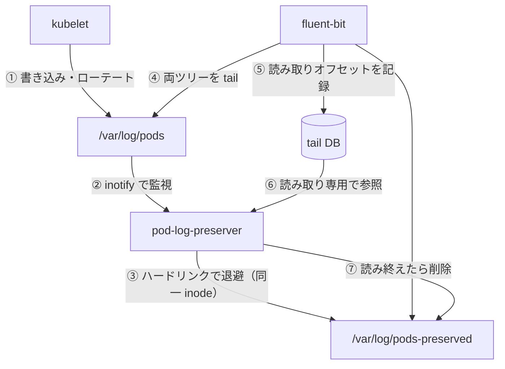

# pod-log-preserver

[](LICENSE)
[-orange.svg)](docs/ja/specification/)

EKS Auto Mode 上で kubelet がローテートした Pod ログを、ログエージェントが収集し終えるまで保全し、その後ディスクを自動で回収するツール。

## なぜ必要か

EKS Auto Mode では kubelet の `containerLogMaxSize`（10MB）と `containerLogMaxFiles`（5）をカスタマイズできない。ログの書き込みがログエージェントの収集より速いコンテナでは、ローテートされたログが読み取られる前に kubelet に削除され、その行が失われることがある。`pod-log-preserver` はこの隙間を埋める。

## 仕組み

DaemonSet として動作し、`/var/log/pods` を監視して各 Pod ログを同一ファイルシステム上の保全ディレクトリに**ハードリンク**する。これにより kubelet が元ファイルを削除してもバイト列は生き続ける。クリーンアップループはログエージェント（fluent-bit）の tail DB を**読み取り専用**で参照し、エージェントが読み終えた保全ファイルだけを削除する。未確認のファイルは age 閾値によるフォールバックで削除される。



詳細な設計は[仕様書](docs/ja/specification/)を参照。

## インストール（Helm）

マルチアーキのイメージ（`ghcr.io/akashisn/pod-log-preserver`）と OCI Helm chart（`oci://ghcr.io/akashisn/charts/pod-log-preserver`）はリリースワークフローで GHCR に publish される。DaemonSet は次のコマンドでインストールする。

```bash
helm install pod-log-preserver \
  oci://ghcr.io/akashisn/charts/pod-log-preserver --version 0.5.0 \
  --namespace kube-system
```

chart は Pod を root・hostPath マウント・ServiceAccount トークン無しで動作させる。namespace はインストール時に `--namespace` で指定する。

## 設定

すべての実行時設定は chart の `config.*` values であり、それぞれ同じ目的の環境変数に対応する（[仕様 §5.4](docs/ja/specification/05-implementation.md#54-設定スキーマ)を参照）。`--set config.<key>=<value>` または values ファイルで上書きする。

| Value | 既定値 | 意味 |
|-------|-------|------|
| `config.watchDir` | `/var/log/pods` | 監視するディレクトリツリー |
| `config.preserveDir` | `/var/log/pods-preserved` | ハードリンクの作成先 |
| `config.cleanupIntervalSec` | `60` | クリーンアップループの周期 |
| `config.cleanupMaxAgeMin` | `5` | `.gz` 以外の orphan の age 閾値 |
| `config.cleanupGzMaxAgeMin` | `60` | `.gz` の orphan の age 閾値 |
| `config.resyncIntervalSec` | `30` | 定期フルリシンクの周期 |
| `config.namespaceFilter` | `""`（すべて） | カンマ区切りの namespace glob パターン |
| `config.logLevel` | `info` | `debug` または `info` |
| `config.metricsPort` | `9113` | Prometheus メトリクスのポート |
| `config.preservedLogDBGlob` | `/var/lib/fluent-bit/flb_kube*.db` | tail DB の glob。空で DB 連携クリーンアップを無効化 |

その他の values（`image.repository`/`image.tag`・`hostPaths.*`・`resources`・`tolerations`・`prometheusScrape`）は [`charts/pod-log-preserver/values.yaml`](charts/pod-log-preserver/values.yaml) に記載している。

## メトリクス

`METRICS_PORT`（既定 `9113`）の `/metrics` で Prometheus エンドポイントを提供する。chart は既定でアノテーションベースの scraping を有効化する。[仕様 §4.2](docs/ja/specification/04-operations.md#42-可観測性)を参照。

| メトリクス | 種類 | 意味 |
|--------|------|------|
| `pod_log_preserver_preserved_files` | gauge | 現在保全ディレクトリにあるファイル数 |
| `pod_log_preserver_orphaned_files` | gauge | リンクカウントが 1 の保全ファイル数 |
| `pod_log_preserver_preserved_bytes` | gauge | 保全ディレクトリ配下の総バイト数 |
| `pod_log_preserver_hardlinks_created_total` | counter | 作成されたハードリンク数 |
| `pod_log_preserver_orphans_removed_total` | counter | 削除された孤児ファイル数 |
| `pod_log_preserver_db_confirmed_removed_total` | counter | tail DB がフルリードを確認した後に削除された孤児数 |
| `pod_log_preserver_fluentbit_db_errors_total` | counter | tail DB の読み取りエラー数 |

## 要件・注意点

- **同一ファイルシステム**: 監視ディレクトリと保全ディレクトリは同一ファイルシステム上になければならない（ハードリンクはファイルシステムを越えられない）。起動時のテストで担保する。
- **root 必須**: kubelet 所有のログの読み取りとハードリンク作成に uid 0 が必要。distroless の `nonroot` タグは使えない。
- **hostPath マウント**: ノードの `/var/log`（rw）と fluent-bit の DB ディレクトリ（例: `/var/lib/fluent-bit`、rw）をホストからマウントする。
- **tail DB は読み取り専用だが rw マウント**: fluent-bit は WAL を使い、WAL reader は `-shm` インデックスへの登録に DB ディレクトリへの書き込み権限を要する。
- **fluent-bit のバージョン**: DB を用いたクリーンアップは fluent-bit **1.x〜5.x** をサポートする（e2e は `3.1.9` で検証）。`in_tail_files` テーブルの `inode`・`offset`・`name` 列のみを読み取るため、5.x で追加された `offset_marker*` 列は無視され、認識できない／非互換な DB は age ベースのクリーンアップに安全に縮退する。スキーマ・マトリックスは[仕様 §5.3](docs/ja/specification/05-implementation.md)を参照。

詳細は[仕様 §4](docs/ja/specification/04-operations.md)を参照。

## ライセンス

[Apache License 2.0](LICENSE)。
