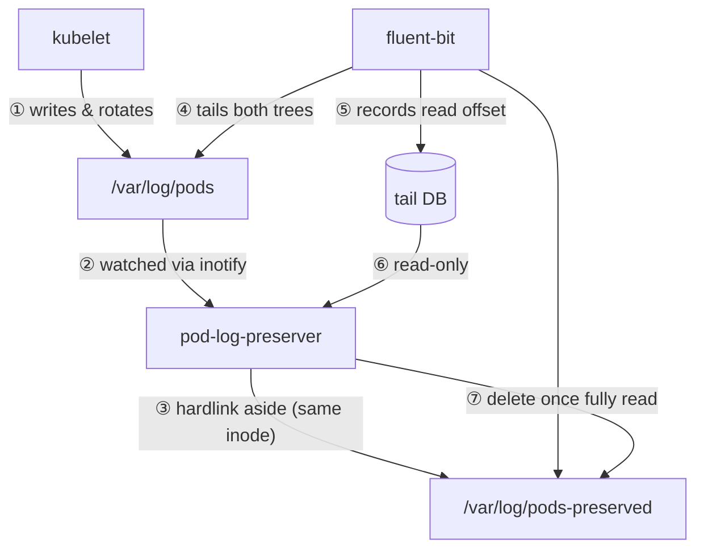

# pod-log-preserver

[](LICENSE)
[](docs/specification/)

Preserve kubelet-rotated pod logs on EKS Auto Mode until a log agent has
collected them — then reclaim the disk automatically.

## Why

On EKS Auto Mode the kubelet's `containerLogMaxSize` (10MB) and
`containerLogMaxFiles` (5) cannot be customized. A container that logs faster
than a log agent collects can have a rotated log deleted by the kubelet before
it was ever read, losing those lines. `pod-log-preserver` closes that gap.

## How it works

Running as a DaemonSet, it watches `/var/log/pods` and **hardlinks** each pod
log into a preserve directory on the same filesystem, keeping the bytes alive
after the kubelet deletes the original. A cleanup loop reads the log agent's
(fluent-bit) tail DB **read-only** and deletes a preserved file only once the
agent has read it fully; files not yet confirmed fall back to an age threshold.



See the [specification](docs/specification/) for the full design.

## Install (Helm)

The multi-arch image (`ghcr.io/akashisn/pod-log-preserver`) and the OCI Helm
chart (`oci://ghcr.io/akashisn/charts/pod-log-preserver`) are published to GHCR
by the release workflow. Install the DaemonSet with:

```bash
helm install pod-log-preserver \
  oci://ghcr.io/akashisn/charts/pod-log-preserver --version 0.5.1 \
  --namespace kube-system
```

The chart runs the pod as root with hostPath mounts and no ServiceAccount token;
the namespace is chosen with `--namespace` at install time.

## Configuration

Every runtime setting is a chart value under `config.*`; each maps to the
environment variable of the same purpose (see
[spec §5.4](docs/specification/05-implementation.md#54-configuration-schema)).
Override with `--set config.<key>=<value>` or a values file.

| Value | Default | Meaning |
|-------|---------|---------|
| `config.watchDir` | `/var/log/pods` | Directory tree to watch |
| `config.preserveDir` | `/var/log/pods-preserved` | Where hardlinks are created |
| `config.cleanupIntervalSec` | `60` | Cleanup loop period |
| `config.cleanupMaxAgeMin` | `5` | Age threshold for non-`.gz` orphans |
| `config.cleanupGzMaxAgeMin` | `60` | Age threshold for `.gz` orphans |
| `config.resyncIntervalSec` | `30` | Periodic full-resync period |
| `config.namespaceFilter` | `""` (all) | Comma-separated namespace glob patterns |
| `config.logLevel` | `info` | `debug` or `info` |
| `config.metricsPort` | `9113` | Prometheus metrics port |
| `config.preservedLogDBGlob` | `/var/lib/fluent-bit/flb_kube*.db` | Tail DB glob; empty disables DB-aware cleanup |

Other values — `image.repository`/`image.tag`, `hostPaths.*`, `resources`,
`tolerations`, and `prometheusScrape` — are documented in
[`charts/pod-log-preserver/values.yaml`](charts/pod-log-preserver/values.yaml).

## Metrics

A Prometheus endpoint on `METRICS_PORT` (default `9113`) at `/metrics`; the
chart enables annotation-based scraping by default. See
[spec §4.2](docs/specification/04-operations.md#42-observability).

| Metric | Type | Meaning |
|--------|------|---------|
| `pod_log_preserver_preserved_files` | gauge | Files currently in the preserve directory |
| `pod_log_preserver_orphaned_files` | gauge | Preserved files with link count 1 |
| `pod_log_preserver_preserved_bytes` | gauge | Total bytes under the preserve directory |
| `pod_log_preserver_hardlinks_created_total` | counter | Hardlinks created |
| `pod_log_preserver_orphans_removed_total` | counter | Orphaned files removed |
| `pod_log_preserver_db_confirmed_removed_total` | counter | Orphans removed after a tail DB confirmed a full read |
| `pod_log_preserver_fluentbit_db_errors_total` | counter | Tail DB read errors |

## Requirements / Caveats

- **Same filesystem**: the watch and preserve directories must share a
  filesystem (hardlinks cannot cross filesystems); a startup test enforces this.
- **Root required**: reading kubelet-owned logs and creating hardlinks need
  uid 0 — the distroless `nonroot` tag is not usable.
- **hostPath mounts**: the node's `/var/log` (rw) and the fluent-bit DB directory
  (e.g. `/var/lib/fluent-bit`, rw) are mounted from the host.
- **Tail DB is read-only but rw-mounted**: fluent-bit uses WAL, and a WAL reader
  must register in the `-shm` index, which needs write access to the DB
  directory.
- **fluent-bit versions**: DB-aware cleanup supports fluent-bit **1.x through
  5.x** (e2e-validated against `3.1.9`). Only the `in_tail_files` table's
  `inode`, `offset`, and `name` columns are read, so 5.x's added
  `offset_marker*` columns are ignored and an unrecognized or incompatible DB
  safely degrades to age-based cleanup. See the schema matrix in
  [spec §5.3](docs/specification/05-implementation.md).

See [spec §4](docs/specification/04-operations.md) for details.

## License

[Apache License 2.0](LICENSE).
