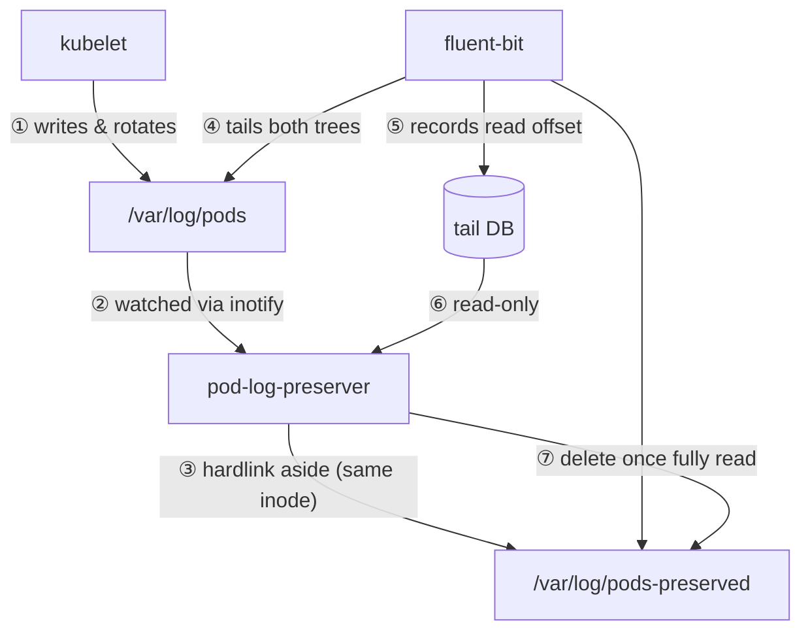

# Getting Started

Preserve kubelet-rotated pod logs on EKS Auto Mode until a log agent has
collected them — then reclaim the disk automatically.

日本語版: [docs/ja/getting-started](/ja/getting-started)

---

## Quick start

### Prerequisites

- A Kubernetes cluster where the kubelet writes pod logs under
  `/var/log/pods` (EKS Auto Mode, or any standard node)
- fluent-bit deployed as a DaemonSet with a `tail` input
- Helm v4

### Install

```bash
helm install pod-log-preserver \
  oci://ghcr.io/akashisn/charts/pod-log-preserver \
  --namespace kube-system
```

The DaemonSet runs as root on every node, watches `/var/log/pods` via inotify,
and hardlinks rotated logs into `/var/log/pods-preserved`.

### Configure fluent-bit to tail the preserved tree

Add a second `tail` input that reads the preserved directory so fluent-bit
picks up logs that would otherwise be lost to kubelet rotation:

```ini
[INPUT]
    Name              tail
    Path              /var/log/pods-preserved/**/*.log*
    DB                /var/lib/fluent-bit/flb_kube_preserved.db
    Read_from_Head    true
    Refresh_Interval  1
    Rotate_Wait       5
```

::: warning
The DB file must match the default glob (`flb_kube*.db`) so pod-log-preserver
can confirm collection via the tail DB. A DB with a name outside the glob will
not be read, and those preserved files will fall back to age-based cleanup.
:::

### Verify

```bash
# Check the DaemonSet is running
kubectl -n kube-system get ds pod-log-preserver

# Look for startup confirmation
kubectl -n kube-system logs ds/pod-log-preserver | head -20

# Query metrics
kubectl -n kube-system exec ds/pod-log-preserver -- wget -qO- http://localhost:9113/metrics
```

Look for `hardlink validation passed` and `watching for log events` in the
startup output.

---

## How it works



Key properties:

- **Hardlinks, not copies** — preserving a file consumes no extra data blocks; disk is reclaimed the moment collection is confirmed
- **Confirmation-first deletion** — a preserved file is deleted only when the tail DB proves fluent-bit has read it fully
- **Age-based fallback** — when DB-aware cleanup is disabled or a file is unconfirmed, deletion falls back to a configurable mtime threshold
- **No Kubernetes API dependency** — operates purely on the node filesystem

---

## Why this exists

On EKS Auto Mode the kubelet's `containerLogMaxSize` (10MB) and
`containerLogMaxFiles` (5) cannot be customized. A container that logs faster
than a log agent collects can have a rotated log deleted by the kubelet before
it was ever read, losing those lines permanently.

`pod-log-preserver` closes that gap by keeping the log's inode alive (via
hardlink) until the agent has demonstrably finished reading it.

---

## What it is not

- **Not** a log shipper — it never reads, parses, or forwards log content
- **Not** a general backup tool — preservation is bounded by collection confirmation or an age threshold
- **Not** a replacement for fluent-bit — it composes with fluent-bit's tail input
- **Not** tied to EKS — works on any Linux node with kubelet-style pod log rotation

---

## Configuration

Every runtime setting is a chart value under `config.*`; each maps to the
environment variable of the same name. Override with `--set config.<key>=<value>`
or a values file.

| Value | Default | Meaning |
|-------|---------|---------|
| `config.watchDir` | `/var/log/pods` | Directory tree to watch |
| `config.preserveDir` | `/var/log/pods-preserved` | Where hardlinks are created |
| `config.cleanupIntervalSec` | `60` | Cleanup loop period |
| `config.cleanupMaxAgeMin` | `5` | Age threshold for non-`.gz` orphans |
| `config.cleanupGzMaxAgeMin` | `60` | Age threshold for `.gz` orphans |
| `config.resyncIntervalSec` | `30` | Periodic full-resync period |
| `config.namespaceFilter` | `""` (all) | Comma-separated namespace glob patterns |
| `config.logLevel` | `info` | `debug` or `info` |
| `config.metricsPort` | `9113` | Prometheus metrics port |
| `config.preservedLogDBGlob` | `/var/lib/fluent-bit/flb_kube*.db` | Tail DB glob; empty disables DB-aware cleanup |

Full schema: [spec §5.4](/specification/05-implementation#54-configuration-schema)
and [`values.yaml`](https://github.com/AkashiSN/pod-log-preserver/blob/main/charts/pod-log-preserver/values.yaml).

---

## Compatibility

- **fluent-bit 1.x through 5.x** — DB-aware cleanup reads only the `in_tail_files`
  table's `inode`, `offset`, and `name` columns; additive schema changes are ignored
- **Linux only** — the event loop uses inotify; preservation uses hardlinks
- **Multi-arch** — `x86_64` and `arm64` images are published
- **Fail-fast preflight** — a startup hardlink test rejects cross-filesystem
  misconfiguration before any work begins

See the [compatibility details](/specification/02-scope) for the full supported
environment.

---

## Project status

**Pre-1.0** (`v0.x.y`) — the configuration schema and metric names may change
between minor releases.

The core preserve → confirm → cleanup loop is validated end-to-end against a
real fluent-bit tail DB on every CI run. See the [roadmap](/specification/06-release#62-roadmap)
and [validated assumptions](/specification/07-risks#72-validated-assumptions).

---

## Project layout

```
├── docs/specification/     Design specification (English)
├── docs/ja/specification/  Japanese translation
├── docs/development/       Style guide, CI/CD design
├── charts/                 Helm chart
├── cmd/                    Binary entry point
├── internal/               Concern-focused packages (config, keeper, metrics, …)
└── test/e2e/               Container and kind e2e harnesses
```

---

## Development

Requires [aqua](https://aquaproj.github.io) and `make`. All tooling is
version-pinned in [`aqua.yaml`](https://github.com/AkashiSN/pod-log-preserver/blob/main/aqua.yaml).

| Command | Purpose |
|---------|---------|
| `make build` | Compile the binary into `bin/` |
| `make test` | Run the test suite with the race detector |
| `make lint` | golangci-lint |
| `make e2e-container` | Build the image and run the container e2e harness |
| `make e2e-kind` | Build the image and run the kind smoke test |

See [CONTRIBUTING.md](https://github.com/AkashiSN/pod-log-preserver/blob/main/CONTRIBUTING.md)
for the development workflow.

---

## License

[Apache License 2.0](https://github.com/AkashiSN/pod-log-preserver/blob/main/LICENSE).
