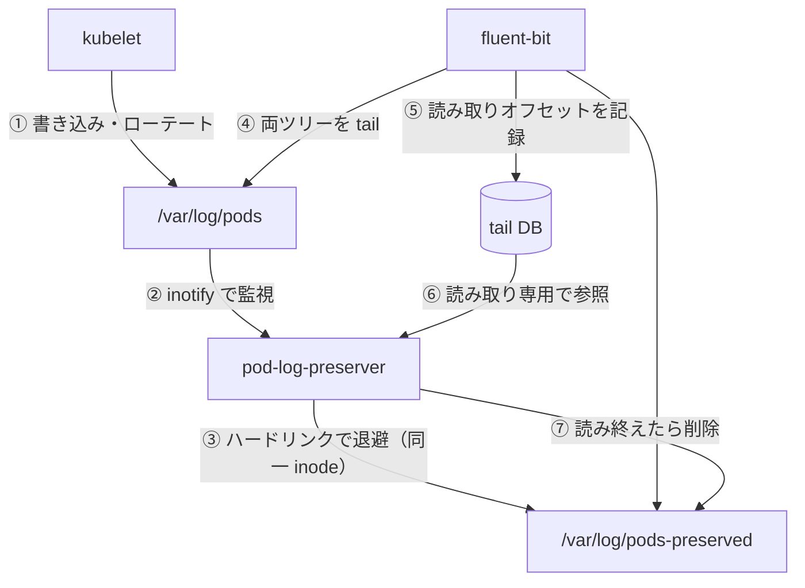

# はじめに

EKS Auto Mode 上で kubelet がローテートした Pod ログを、ログエージェントが収集し終えるまで保全し、その後ディスクを自動で回収する。

English: [docs/getting-started](/getting-started)

---

## クイックスタート

### 前提条件

- kubelet が `/var/log/pods` 配下に Pod ログを書き込む Kubernetes クラスタ
  （EKS Auto Mode、またはその他の標準ノード）
- DaemonSet としてデプロイされた fluent-bit（`tail` input を使用）
- Helm v4

### インストール

```bash
helm install pod-log-preserver \
  oci://ghcr.io/akashisn/charts/pod-log-preserver \
  --namespace kube-system
```

DaemonSet はすべてのノードで root として動作し、`/var/log/pods` を inotify で
監視し、ローテートされたログを `/var/log/pods-preserved` にハードリンクする。

### fluent-bit で保全ツリーを tail する設定

保全ディレクトリを読む 2 つ目の `tail` input を追加し、kubelet のローテーション
で失われるはずだったログを fluent-bit が拾えるようにする:

```ini
[INPUT]
    Name              tail
    Path              /var/log/pods-preserved/**/*.log*
    DB                /var/lib/fluent-bit/flb_kube_preserved.db
    Read_from_Head    true
    Refresh_Interval  1
    Rotate_Wait       5
```

::: warning
DB ファイルはデフォルトのグロブ（`flb_kube*.db`）に一致する必要がある。
グロブ外の名前を持つ DB は読み取られず、対応する保全ファイルは age ベースの
クリーンアップにフォールバックする。
:::

### 動作確認

```bash
# DaemonSet の稼働確認
kubectl -n kube-system get ds pod-log-preserver

# 起動ログの確認
kubectl -n kube-system logs ds/pod-log-preserver | head -20

# メトリクスの確認
kubectl -n kube-system exec ds/pod-log-preserver -- wget -qO- http://localhost:9113/metrics
```

起動ログに `hardlink validation passed` と `watching for log events` が
表示されることを確認する。

---

## 仕組み



主要な特性:

- **ハードリンクであってコピーではない** — 保全は追加のデータブロックを消費せず、収集が確認された瞬間にディスクを回収する
- **確認優先の削除** — tail DB が fluent-bit のフルリードを証明した場合にのみ保全ファイルを削除する
- **Age ベースのフォールバック** — DB を利用したクリーンアップが無効、またはファイルが未確認の場合は mtime しきい値にフォールバックする
- **Kubernetes API 非依存** — ノードのファイルシステムのみで動作する

---

## なぜ必要か

EKS Auto Mode では kubelet の `containerLogMaxSize`（10MB）と
`containerLogMaxFiles`（5）をカスタマイズできない。ログの書き込みがログ
エージェントの収集より速いコンテナでは、ローテートされたログが読み取られる前に
kubelet に削除され、その行が永久に失われることがある。

`pod-log-preserver` は、エージェントが読み終えたと確認できるまでログの inode を
ハードリンクで生かし続けることで、この隙間を埋める。

---

## 何でないか

- ログシッパー**ではない** — ログの内容を読み取ったり解析したり転送したりしない
- 汎用バックアップツール**ではない** — 保全は収集確認または age しきい値で境界づけられる
- fluent-bit の代替**ではない** — fluent-bit の tail input と組み合わせて動作する
- EKS 専用**ではない** — kubelet スタイルの Pod ログローテートを持つ任意の Linux ノードで動作する

---

## 設定

すべての実行時設定は chart の `config.*` values であり、それぞれ同名の環境変数に
対応する。`--set config.<key>=<value>` または values ファイルで上書きする。

| Value | デフォルト | 意味 |
|-------|-----------|------|
| `config.watchDir` | `/var/log/pods` | 監視するディレクトリツリー |
| `config.preserveDir` | `/var/log/pods-preserved` | ハードリンクの作成先 |
| `config.cleanupIntervalSec` | `60` | クリーンアップループの周期 |
| `config.cleanupMaxAgeMin` | `5` | 非 `.gz` 孤児の age しきい値 |
| `config.cleanupGzMaxAgeMin` | `60` | `.gz` 孤児の age しきい値 |
| `config.resyncIntervalSec` | `30` | 定期 full resync の周期 |
| `config.namespaceFilter` | `""`（すべて） | カンマ区切りの namespace グロブパターン |
| `config.logLevel` | `info` | `debug` または `info` |
| `config.metricsPort` | `9113` | Prometheus メトリクスのポート |
| `config.preservedLogDBGlob` | `/var/lib/fluent-bit/flb_kube*.db` | tail DB のグロブ。空で DB 連携クリーンアップを無効化 |

フルスキーマ: [仕様 §5.4](/ja/specification/05-implementation#54-設定スキーマ)
および [`values.yaml`](https://github.com/AkashiSN/pod-log-preserver/blob/main/charts/pod-log-preserver/values.yaml)。

---

## 互換性

- **fluent-bit 1.x〜5.x** — DB を利用したクリーンアップは `in_tail_files` テーブルの
  `inode`・`offset`・`name` 列のみを読み取る。追加的なスキーマ変更は無視される
- **Linux のみ** — イベントループは inotify を使用し、保全にはハードリンクを使用する
- **マルチアーキ** — `x86_64` と `arm64` イメージを publish する
- **Fail-fast の起動テスト** — 異なるファイルシステム上の設定ミスは作業開始前に拒否される

対応環境の詳細は[互換性の詳細](/ja/specification/02-scope)を参照。

---

## プロジェクトの状態

**Pre-1.0**（`v0.x.y`）— 設定スキーマとメトリクス名はマイナーリリース間で変更
される可能性がある。

保全 → 確認 → クリーンアップの全ループは、CI 実行のたびに実際の fluent-bit
tail DB に対してエンドツーエンドで検証されている。
[ロードマップ](/ja/specification/06-release#62-ロードマップ)と
[検証済みの前提](/ja/specification/07-risks#72-検証済みの前提)を参照。

---

## プロジェクト構成

```
├── docs/specification/     設計仕様書（英語）
├── docs/ja/specification/  日本語訳
├── docs/development/       スタイルガイド、CI/CD 設計
├── charts/                 Helm chart
├── cmd/                    バイナリのエントリポイント
├── internal/               関心ごとのパッケージ（config, keeper, metrics, …）
└── test/e2e/               コンテナおよび kind の e2e ハーネス
```

---

## 開発

[aqua](https://aquaproj.github.io) と `make` が必要。すべてのツールは
[`aqua.yaml`](https://github.com/AkashiSN/pod-log-preserver/blob/main/aqua.yaml)
でバージョン固定されている。

| コマンド | 目的 |
|---------|------|
| `make build` | バイナリを `bin/` にコンパイル |
| `make test` | race detector 付きでテストスイートを実行 |
| `make lint` | golangci-lint |
| `make e2e-container` | イメージをビルドしコンテナ e2e ハーネスを実行 |
| `make e2e-kind` | イメージをビルドし kind smoke テストを実行 |

開発ワークフローの詳細は [CONTRIBUTING.md](https://github.com/AkashiSN/pod-log-preserver/blob/main/CONTRIBUTING.md)
を参照。

---

## ライセンス

[Apache License 2.0](https://github.com/AkashiSN/pod-log-preserver/blob/main/LICENSE)。
