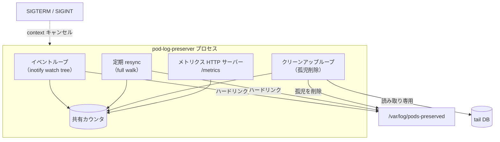
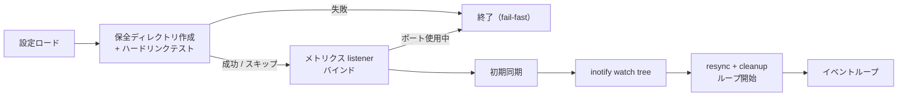

# 5. 実装

## 5.1 アーキテクチャ

DaemonSet として動作する単一バイナリの Go プログラムで、Go の標準的なプロジェクト構成を採る。エントリポイントは `cmd/pod-log-preserver` で、各部品を配線するだけの薄い層に保つ。関心ごとのパッケージは `internal/` 配下に置く。

| パッケージ | 関心 |
| --- | --- |
| `internal/config` | 環境変数による設定（§5.4） |
| `internal/logging` | 標準ロガー上のレベル別ログ |
| `internal/metrics` | 共有のメモリ上カウンタ |
| `internal/keeper` | inotify 監視ツリー・hardlink 保全・tail DB 読み取り・クリーンアップ |
| `internal/validate` | 起動時の hardlink ゲート（§4.1） |
| `internal/version` | ビルドバージョン。`internal/version/VERSION` を `//go:embed` で埋め込む |

3 つの並行ループがメモリ上のメトリクスカウンタを共有し、context 経由でシャットダウンを協調させる。

1. **イベントループ** —— watch ディレクトリに対する `inotify` の watch tree が新規ファイル・ディレクトリに反応し、ログの出現・ローテートに応じてハードリンクを作成する。
2. **定期的な resync** —— watch ディレクトリの full walk を固定間隔で実行し、inotify が取り逃したもの（例: キューのオーバーフロー）を補う。
3. **クリーンアップループ** —— 保全ディレクトリを定期的に walk し、確認済みまたは経過時間切れの孤児を削除し、空ディレクトリを整理する。

メトリクス用の HTTP サーバーが並行して動作する。SIGTERM / SIGINT は context をキャンセルし、inotify の fd を閉じてイベントループのブロックを解除し、クリーンなシャットダウンを行う。

## 5.2 起動シーケンス

1. 環境変数から設定をロードする（§5.4）。数値が範囲外の場合（非正の interval / age、または `1..65535` 外の `METRICS_PORT`）は **早期に失敗** し、該当するキーをすべてまとめて報告する。
2. 保全ディレクトリを作成し、Pod 自身のコンテナログに対して **ハードリンク検証テスト**（§4.1）を実行する。ハードリンクできない場合は早期に失敗する。
3. メトリクス listener を同期的にバインドし（`METRICS_PORT` が使用中なら早期に失敗する）、`/metrics` の提供を開始する。
4. 初期同期: watch ディレクトリを walk し、既存の一致するログをすべてハードリンクする。
5. 再帰的な inotify の watch tree を確立する。
6. resync / クリーンアップループを開始し、イベントループに入る。

## 5.3 Tail DB の読み取り

各クリーンアップサイクルは、グロブに一致するすべての DB を読み取り専用・単一コネクションの SQLite ハンドルで開き、1 つのクエリ（`SELECT inode, offset, name FROM in_tail_files`）を発行し、DB ごとに inode → (offset, name) のマップを構築する。失敗した DB はログに記録されスキップされ、致命的エラーとはならない。ランタイムドライバは純粋な Go 実装の `modernc.org/sqlite`（CGO 不使用）であるため、イメージを distroless static にできる。読み取り専用の DSN には `mode=ro` と `busy_timeout` プラグマを使用する。

## 5.4 設定スキーマ

すべての設定は環境変数経由で行われる。

| 環境変数 | デフォルト | 意味 |
|---------|---------|---------|
| `WATCH_DIR` | `/var/log/pods` | Pod ログを監視するディレクトリツリー |
| `PRESERVE_DIR` | `/var/log/pods-preserved` | ハードリンクの作成先 |
| `CLEANUP_INTERVAL_SEC` | `60` | クリーンアップループの周期 |
| `CLEANUP_MAX_AGE_MIN` | `5` | 非 `.gz` 孤児の age しきい値 |
| `CLEANUP_GZ_MAX_AGE_MIN` | `60` | `.gz` 孤児の age しきい値 |
| `RESYNC_INTERVAL_SEC` | `30` | 定期的な full-resync の周期 |
| `NAMESPACE_FILTER` | （空 = すべて） | カンマ区切りの namespace グロブパターン |
| `LOG_LEVEL` | `info` | `debug` または `info` |
| `METRICS_PORT` | `9113` | Prometheus メトリクスのポート |
| `PRESERVED_LOG_DB_GLOB` | `/var/lib/fluent-bit/flb_kube*.db` | Tail DB のグロブ。空にすると DB を利用したクリーンアップを無効化する |
| `POD_NAMESPACE` | （空） | この Pod の namespace（downward API）。起動時ハードリンクテスト用に Pod 自身のコンテナログを特定する |
| `POD_NAME` | （空） | この Pod の名前（downward API） |
| `POD_UID` | （空） | この Pod の UID（downward API） |

`POD_NAMESPACE`/`POD_NAME`/`POD_UID` は Kubernetes の downward API（API サーバー
ではない）経由で注入される。これらを組み合わせて `WATCH_DIR/<POD_NAMESPACE>_<POD_NAME>_<POD_UID>/`
配下にある Pod 自身のコンテナログを特定し、§5.2 の起動時ハードリンクテストに用いる。
いずれかが未設定の場合、テストは失敗せず警告してスキップする。

4 つの interval / age 値（`CLEANUP_INTERVAL_SEC`・`CLEANUP_MAX_AGE_MIN`・
`CLEANUP_GZ_MAX_AGE_MIN`・`RESYNC_INTERVAL_SEC`）は **正の整数** でなければならない
（`time.Ticker` / `time.Duration` の入力となり、非正の duration は実行時に panic するため）。
また `METRICS_PORT` は `1..65535` の範囲でなければならない。ロード時の検証（§5.2 ステップ 1）が
範囲外の値を、該当キーを明示した fail-fast エラーで拒否するため、ticker の panic として
遅れて顕在化することはない。
