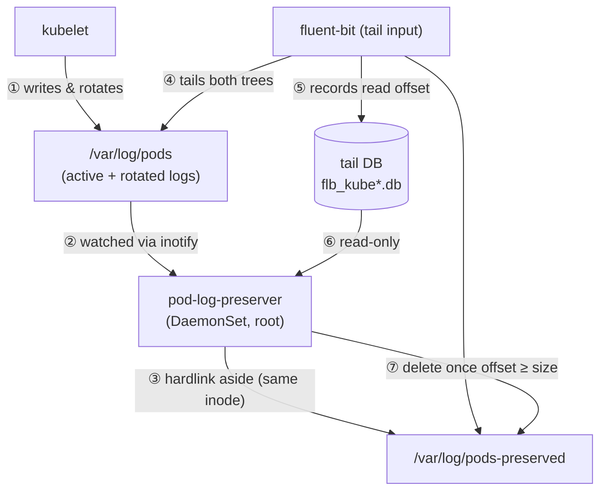

# 1. Overview

## 1.1 Background

On EKS Auto Mode the kubelet is managed and its log-rotation settings —
`containerLogMaxSize` (default 10MB) and `containerLogMaxFiles` (default 5) —
cannot be customized. A container that logs faster than a log agent collects can
therefore have a rotated log file deleted by the kubelet before it was ever
read, losing those lines permanently.

## 1.2 Goals

- Preserve every rotated pod log until a log agent has demonstrably collected it.
- Add no measurable load to the node: hardlinks (not copies), an inotify event
  loop, and a single-connection read-only query of the log agent's tail DB.
- Reclaim disk promptly: delete a preserved file as soon as collection is
  confirmed, never keeping more than necessary.
- Ship as a self-contained DaemonSet with SQLite as the only external
  dependency, on a distroless static image.

## 1.3 Non-Goals

- Not a log shipper. `pod-log-preserver` never reads, parses, or forwards log
  content; it only preserves and reclaims files. Collection remains the log
  agent's job.
- Not a general backup tool. Preservation is bounded by collection confirmation
  or an age threshold, not retained indefinitely.
- No cross-node aggregation and no external datastore.

## 1.4 Terminology

- **Active log**: the current `<n>.log` file the kubelet is writing.
- **Rotated log**: a kubelet-rotated `<n>.log.<timestamp>` (optionally `.gz`).
- **Preserved file**: a hardlink created under the preserve directory pointing
  at the same inode as a pod log.
- **Orphan**: a preserved file whose link count has dropped to 1 — the original
  pod log has been deleted, so only the preserved hardlink remains.
- **Tail DB**: the log agent's (fluent-bit) SQLite database recording, per
  inode, the byte offset it has read and the path it knows the file by.
- **Confirmed**: the tail DB shows the recorded offset has reached the file
  size for a preserved file — the agent has read it fully.

## 1.5 Position in the log-collection pipeline

`pod-log-preserver` sits beside the log agent, not in its path. The kubelet
writes logs under `/var/log/pods`; the agent tails them; `pod-log-preserver`
hardlinks them aside and, by reading the agent's own progress DB read-only,
deletes each preserved link only once the agent has finished with it.

The numbered edges are the end-to-end flow: the kubelet writes and rotates logs
(①); `pod-log-preserver` watches them (②) and hardlinks each aside, sharing the
inode (③); fluent-bit tails both the live and preserved trees (④) and records
its read offset per inode in its tail DB (⑤); `pod-log-preserver` reads that DB
read-only (⑥) and deletes a preserved link only once the recorded offset has
reached the file size (⑦).
