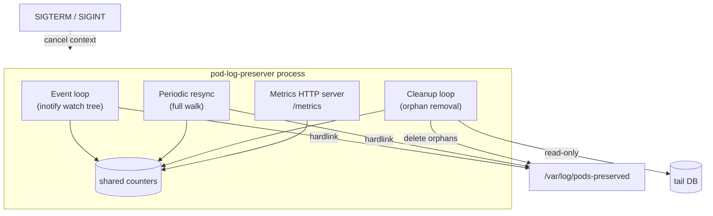
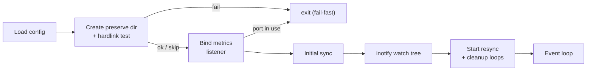

# 5. Implementation

## 5.1 Architecture

A single Go binary running as a DaemonSet, laid out in the conventional Go
project structure. The entry point is `cmd/pod-log-preserver`, which stays thin
and only wires the pieces together; the concern-focused packages live under
`internal/`:

| Package | Concern |
| --- | --- |
| `internal/config` | environment-variable configuration (§5.4) |
| `internal/logging` | leveled logging on the standard logger |
| `internal/metrics` | the shared in-memory counters |
| `internal/keeper` | the inotify watch tree, hardlink preservation, tail-DB read, and cleanup |
| `internal/validate` | the startup hardlink gate (§4.1) |
| `internal/version` | the build version, `//go:embed`-ed from `internal/version/VERSION` |

Three concurrent loops share the in-memory metric counters and coordinate
shutdown via a context:

1. **Event loop** — an `inotify` watch tree over the watch directory reacts to
   new files and directories, creating hardlinks as logs appear/rotate.
2. **Periodic resync** — a full walk of the watch directory on a fixed interval,
   catching anything inotify missed (e.g. a queue overflow).
3. **Cleanup loop** — a periodic walk of the preserve directory that removes
   confirmed or aged-out orphans and prunes empty directories.

A metrics HTTP server runs alongside. SIGTERM/SIGINT cancels the context and
closes the inotify fd to unblock the event loop for a clean shutdown.

## 5.2 Startup sequence

1. Load configuration from environment variables (§5.4).
2. Create the preserve directory; run the **hardlink validation test** (§4.1)
   against the pod's own container log — fail fast if it cannot hardlink.
3. Bind the metrics listener synchronously — fail fast if `METRICS_PORT` is
   already in use — and start serving `/metrics`.
4. Initial sync: walk the watch directory and hardlink all existing matching
   logs.
5. Establish the recursive inotify watch tree.
6. Start the resync and cleanup loops; enter the event loop.

## 5.3 Tail DB read

Each cleanup cycle opens every DB matching the glob with a read-only,
single-connection SQLite handle and issues one query
(`SELECT inode, offset, name FROM in_tail_files`), building an
inode → (offset, name) map per DB. A failed DB is logged and skipped, never
fatal. The runtime driver is pure-Go `modernc.org/sqlite` (no CGO) so the image
can be distroless static; the read-only DSN uses `mode=ro` and a
`busy_timeout` pragma.

## 5.4 Configuration schema

All configuration is via environment variables:

| Env var | Default | Meaning |
|---------|---------|---------|
| `WATCH_DIR` | `/var/log/pods` | Directory tree to watch for pod logs |
| `PRESERVE_DIR` | `/var/log/pods-preserved` | Where hardlinks are created |
| `CLEANUP_INTERVAL_SEC` | `60` | Cleanup loop period |
| `CLEANUP_MAX_AGE_MIN` | `5` | Age threshold for non-`.gz` orphans |
| `CLEANUP_GZ_MAX_AGE_MIN` | `60` | Age threshold for `.gz` orphans |
| `RESYNC_INTERVAL_SEC` | `30` | Periodic full-resync period |
| `NAMESPACE_FILTER` | (empty = all) | Comma-separated namespace glob patterns |
| `LOG_LEVEL` | `info` | `debug` or `info` |
| `METRICS_PORT` | `9113` | Prometheus metrics port |
| `PRESERVED_LOG_DB_GLOB` | `/var/lib/fluent-bit/flb_kube*.db` | Tail DB glob; empty disables DB-aware cleanup |
| `POD_NAMESPACE` | (empty) | This pod's namespace (downward API); locates the pod's own container log for the startup hardlink test |
| `POD_NAME` | (empty) | This pod's name (downward API) |
| `POD_UID` | (empty) | This pod's UID (downward API) |

`POD_NAMESPACE`/`POD_NAME`/`POD_UID` are injected via the Kubernetes downward
API (not the API server). Together they locate the pod's own container log under
`WATCH_DIR/<POD_NAMESPACE>_<POD_NAME>_<POD_UID>/` for the §5.2 startup hardlink
test. When any is unset, the test warns and skips instead of failing.
