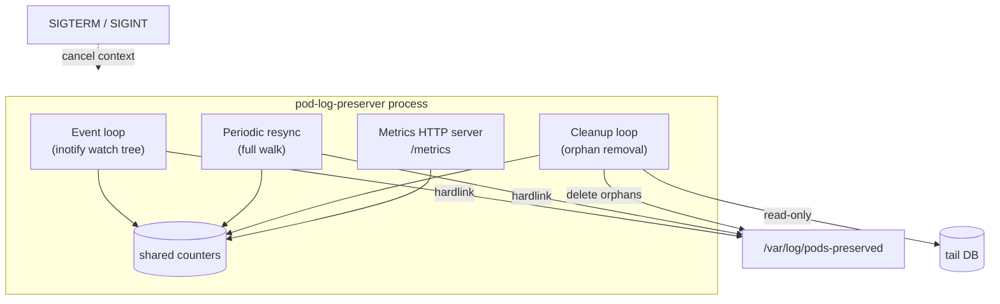
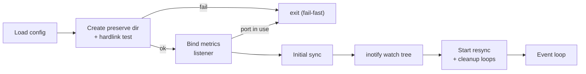

# 5. Implementation

## 5.1 Architecture

A single Go binary running as a DaemonSet, laid out in the conventional Go
project structure. The entry point is `cmd/pod-log-preserver`, which stays thin
and only wires the pieces together; the concern-focused packages live under
`internal/`:

| Package | Concern |
| --- | --- |
| `internal/config` | environment-variable configuration (§5.4) |
| `internal/logging` | leveled logging on the standard logger |
| `internal/metrics` | the shared in-memory counters |
| `internal/keeper` | the inotify watch tree, hardlink preservation, tail-DB read, and cleanup |
| `internal/validate` | the startup hardlink gate (§4.1) |
| `internal/version` | the build version, `//go:embed`-ed from `internal/version/VERSION` |

Three concurrent loops share the in-memory metric counters and coordinate
shutdown via a context:

1. **Event loop** — an `inotify` watch tree over the watch directory reacts to
   new files and directories, creating hardlinks as logs appear/rotate.
2. **Periodic resync** — a full walk of the watch directory on a fixed interval,
   catching anything inotify missed (e.g. a queue overflow).
3. **Cleanup loop** — a periodic walk of the preserve directory that removes
   confirmed or aged-out orphans and prunes empty directories.

A metrics HTTP server runs alongside. SIGTERM/SIGINT cancels the context and
closes the inotify fd to unblock the event loop for a clean shutdown.

## 5.2 Startup sequence

1. Load configuration from environment variables (§5.4); **fail fast** if an
   integer value is non-numeric (a typo such as `CLEANUP_INTERVAL_SEC=5m`) or a
   numeric value is out of range (a non-positive interval or age, or a
   `METRICS_PORT` outside `1..65535`), reporting every offending key at once.
2. Create the preserve directory; run the deterministic **hardlink validation
   test** (§4.1) — confirm the watch and preserve directories share a filesystem
   (matching `st_dev`) and that a throwaway probe hardlink inside the preserve
   directory succeeds — and fail fast otherwise. The test depends on neither pod
   identity nor any pre-existing log, and writes nothing into the watch tree.
3. Bind the metrics listener synchronously — fail fast if `METRICS_PORT` is
   already in use — and start serving `/metrics`.
4. Initial sync: walk the watch directory and hardlink all existing matching
   logs.
5. Establish the recursive inotify watch tree.
6. Start the resync and cleanup loops; enter the event loop.

## 5.3 Tail DB read

Each cleanup cycle opens every DB matching the glob with a read-only,
single-connection SQLite handle and issues one query
(`SELECT inode, offset, name FROM in_tail_files`), building an
inode → (offset, name) map per DB. A failed DB is logged and skipped, never
fatal. The runtime driver is pure-Go `modernc.org/sqlite` (no CGO) so the image
can be distroless static; the read-only DSN uses `mode=ro` and a
`busy_timeout` pragma.

**Supported fluent-bit versions (tail-DB schema matrix).** The read depends
only on fluent-bit's `in_tail_files` table and its `inode`, `offset`, and `name`
columns, where `offset` is the number of bytes fluent-bit has read (comparable
to the file's size). Because the query **names** those three columns rather than
using `SELECT *`, additive schema changes do not affect it.

| fluent-bit | `in_tail_files` columns | tail-DB read |
| --- | --- | --- |
| **1.x – 4.x** (every released major) | `id, name, offset, inode, created, rotated` | **supported** — the schema is byte-for-byte identical across these majors (verified against `plugins/in_tail/tail_sql.h` at `v1.9.10`, `v2.2.3`, `v3.0.7`, `v3.1.9`, `v3.2.0`, `v4.0.0`, `v4.2.3`) |
| **5.x** (`v5.0.0` and later) | the above **+** `offset_marker`, `offset_marker_size` | **supported** — the two added columns are ignored by the named-column query (verified against `tail_sql.h` at `v5.0.9`) |
| a DB missing `inode`, or a non-fluent-bit schema | unrecognized | the query errors; it is counted (`pod_log_preserver_fluentbit_db_errors_total`), the DB is skipped, and its orphans fall back to age-based cleanup |

The e2e harness pins `fluent/fluent-bit:3.1.9` as the live-validated version;
the version-independence in the table is pinned by a unit-test support matrix
that builds each major's schema and asserts the read. The fallback direction is
always safe — deletion is delayed, never premature — so a non-fluent-bit or a
future-incompatible schema degrades to age-only cleanup rather than a silent
misread (see §7.3 for the pluggable-reader open question).

## 5.4 Configuration schema

All configuration is via environment variables:

| Env var | Default | Meaning |
|---------|---------|---------|
| `WATCH_DIR` | `/var/log/pods` | Directory tree to watch for pod logs |
| `PRESERVE_DIR` | `/var/log/pods-preserved` | Where hardlinks are created |
| `CLEANUP_INTERVAL_SEC` | `60` | Cleanup loop period |
| `CLEANUP_MAX_AGE_MIN` | `5` | Age threshold for non-`.gz` orphans |
| `CLEANUP_GZ_MAX_AGE_MIN` | `60` | Age threshold for `.gz` orphans |
| `RESYNC_INTERVAL_SEC` | `30` | Periodic full-resync period |
| `NAMESPACE_FILTER` | (empty = all) | Comma-separated namespace glob patterns |
| `LOG_LEVEL` | `info` | `debug` or `info` |
| `METRICS_PORT` | `9113` | Prometheus metrics port |
| `PRESERVED_LOG_DB_GLOB` | `/var/lib/fluent-bit/flb_kube*.db` | Tail DB glob; empty disables DB-aware cleanup |

The four interval/age values (`CLEANUP_INTERVAL_SEC`, `CLEANUP_MAX_AGE_MIN`,
`CLEANUP_GZ_MAX_AGE_MIN`, `RESYNC_INTERVAL_SEC`) must be **positive integers**
— they become `time.Ticker`/`time.Duration` inputs and a non-positive duration
would panic at runtime — and `METRICS_PORT` must be in `1..65535`. Every
integer-valued key (including `METRICS_PORT`) must also **parse as an integer**:
a value that is set but non-numeric is not silently ignored. Load-time
validation (§5.2 step 1) rejects both non-numeric and out-of-range values with a
clear fail-fast error naming each offending key, rather than absorbing the typo
into the default or deferring the failure to a ticker panic.

The Helm chart mirrors these constraints in
`charts/pod-log-preserver/values.schema.json`, which Helm validates at
template/install time, so a misspelled key or an out-of-range value is rejected
before it reaches the cluster — a fast first line of defense ahead of the
binary's load-time validation.
